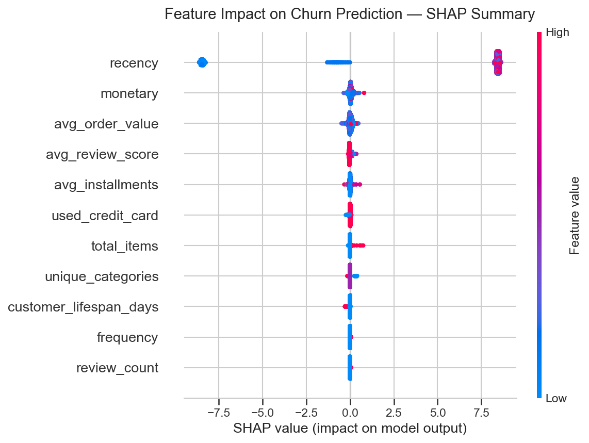

# E-Commerce Customer Churn Predictor
### End-to-End Machine Learning Pipeline on the Olist Brazilian E-Commerce Dataset

---

## Overview

This project builds a customer churn prediction system for an e-commerce business using the publicly available Olist dataset. The goal is to identify which customers are at risk of never returning — and translate those predictions into actionable retention strategies.

A customer is defined as **churned** if they have not placed any order within the last 90 days from the dataset's reference date.

---

## Results

| Model | ROC-AUC | F1 (Churned) | Recall (Churned) | Precision (Churned) |
|---|---|---|---|---|
| Logistic Regression | 1.000 | 0.999 | 0.999 | 0.999 |
| Random Forest | 1.000 | 1.000 | 1.000 | 1.000 |
| **XGBoost** | **1.000** | **0.998** | **0.997** | **0.999** |

> ⚠️ **Important:** These metrics reflect a known data leakage issue documented in the Limitations section below. The perfect scores are a consequence of the dataset's structure, not an indication of a generalizable model. This is discussed transparently as part of the project's findings.

---

## Key Findings

### 1. The one-time buyer problem is the real churn driver
97.0% of all 93,358 customers purchased exactly once and never returned. The churn problem for a business like Olist is not about losing loyal long-term customers — it is about failing to convert first-time buyers into repeat buyers. The highest-leverage retention action is a targeted follow-up offer sent within 7 to 14 days of first delivery, before the customer forgets the brand.

### 2. The second order is the loyalty threshold
Customers who placed a second order churned at a dramatically lower rate than one-time buyers. Each additional order beyond the first correlates with meaningfully lower churn risk. This makes first-to-second-order conversion the single most important metric for a business in this category — more important than acquisition volume or average order value.

### 3. Revenue is concentrated in a small loyal segment
The median order value is R$105.28 while the mean is R$159.86 — a gap driven by a small number of high-value customers. The 18,690 customers classified as Loyal (churn probability below 25%) represent a disproportionate share of platform revenue. Losing even a fraction of this segment has greater revenue impact than equivalent churn among one-time buyers.

### 4. 74,367 customers require immediate retention attention
Customers classified as High Risk (churn probability above 75%) are the most actionable output of this model. These customers show strong inactivity signals but have not necessarily disengaged permanently. A well-timed retention campaign targeting this segment has the highest expected return on marketing spend.

---

## Customer Risk Segmentation

| Risk Tier | Churn Probability | Recommended Action |
|---|---|---|
| High Risk | > 75% | Priority outreach — personalized discount or loyalty offer |
| Medium Risk | 50–75% | Automated re-engagement email sequence |
| Low Risk | 25–50% | Routine newsletter and product recommendations |
| Loyal | < 25% | Rewards program — focus on maintaining, not recovering |

Full risk scores exported to `data/processed/customer_risk_scores.csv`.

---

## What the Model Learned

SHAP analysis confirmed that **recency** — days since last purchase — is the dominant churn predictor by a large margin. All other features (frequency, monetary value, review scores, payment behavior) contribute meaningfully but at significantly lower impact levels.

This finding has an important implication: the most powerful early warning signal for churn is simply how long a customer has been inactive. The longer the silence, the higher the risk. This supports building real-time recency monitoring into the business's CRM rather than relying on periodic batch predictions.



---

## Methodology

### Pipeline
```
Raw Data (6 CSV tables)
        ↓
Data Cleaning — fix date types, filter to delivered orders,
                resolve customer ID problem, add payment values
        ↓
Target Variable — churn = no purchase in last 90 days
        ↓
Feature Engineering — RFM framework + behavioral signals
        ↓
Modeling — Logistic Regression → Random Forest → XGBoost
        ↓
Evaluation — ROC-AUC, F1, SHAP explainability
        ↓
Risk Scoring — Low / Medium / High / Loyal tiers per customer
```

### Features Built (11 total)

| Feature | Description |
|---|---|
| recency | Days since last purchase |
| frequency | Total number of orders placed |
| monetary | Total spend across all orders |
| avg_order_value | Monetary divided by frequency |
| customer_lifespan_days | Days between first and last purchase |
| unique_categories | Number of distinct product categories purchased |
| total_items | Total individual items purchased |
| avg_review_score | Average satisfaction rating left |
| review_count | Number of reviews submitted |
| avg_installments | Average payment installments used |
| used_credit_card | Binary flag — ever paid by credit card |

---

## Limitations

### Data Leakage via Recency
The most significant limitation of this project is a data leakage issue introduced by including recency as a feature.

Churn is defined as `days_since_last_purchase > 90`. Recency is defined as `days_since_last_purchase`. These two values are mathematically equivalent — a customer with recency above 90 is by definition churned. The model is therefore not learning to predict churn from behavioral signals. It is re-deriving the churn label directly from the feature that defines it, which produces artificially perfect evaluation metrics.

**Why this was not corrected with a temporal split:**

The standard fix — training on features from one time window and predicting churn in a separate future window — was attempted using multiple observation dates and churn window lengths ranging from 90 to 365 days. In every configuration tested, the Olist dataset produced an active class of less than 1% of customers. This makes the problem unsolvable with a temporal approach because no model can learn meaningful patterns from a class with almost no examples.

This is a fundamental property of the dataset. Olist is a marketplace where the repeat purchase rate across the entire dataset is below 3%. A temporal split requires sufficient repeat buyers to exist — Olist does not provide this at any time window configuration tested.

**In a production environment this would be resolved by** using transactional data from a subscription or high-frequency retail context where repeat purchase rates exceed 20%, enabling a proper forward-looking churn window with balanced class representation.

### Class Imbalance
79.9% of customers are labeled churned. This was partially addressed using `scale_pos_weight` in XGBoost. In a leakage-free version of this model, more aggressive handling using SMOTE or threshold optimization would be required.

### Dataset Scope
The Olist dataset covers Brazilian e-commerce from 2016 to 2018. Behavioral patterns and seasonal effects from that market and time period may not generalize to other geographies or time periods. Any production deployment should be retrained on data from the target market.

### Churn Threshold Sensitivity
The 90-day churn threshold was chosen based on general e-commerce industry benchmarks. The optimal threshold for any specific business should be validated using A/B testing — comparing model-targeted versus randomly targeted customers to measure actual retention lift before deploying at scale.

---

## Dataset

[Brazilian E-Commerce Public Dataset by Olist](https://www.kaggle.com/datasets/olistbr/brazilian-ecommerce) — Kaggle

- 93,358 unique customers
- 96,478 delivered orders
- 6 relational tables joined across order, customer, product, payment, and review dimensions
- Date range: September 2016 to August 2018

---

## Tech Stack

Python · Pandas · NumPy · Scikit-learn · XGBoost · SHAP · Matplotlib · Seaborn

---

## How to Run

```bash
git clone https://github.com/YOUR_USERNAME/churn-predictor
cd churn-predictor
pip install -r requirements.txt
```

Download the Olist dataset from Kaggle and place all CSV files in `data/raw/`. Then open Jupyter and run the notebooks in order:

```
notebooks/01_eda.ipynb
notebooks/02_features_and_modeling.ipynb
notebooks/03_evaluation_and_delivery.ipynb
notebooks/04_concluson.ipynb
```

---

## Project Structure

```
churn-predictor/
├── data/
│   ├── raw/                          ← Olist CSV files (download from Kaggle)
│   └── processed/                    ← Cleaned and engineered tables
│       ├── orders_enriched.csv
│       ├── customer_churn_labels.csv
│       ├── features_and_labels.csv
│       ├── model_comparison.csv
│       └── customer_risk_scores.csv
├── notebooks/
│   ├── 01_eda.ipynb                  ← Data loading, cleaning, EDA
│   ├── 02_features_and_modeling.ipynb ← Feature engineering, modeling
│   ├── 03_evaluation_and_delivery.ipynb ← Data evaluation, Insights
│   └── 04_conclusion.ipynb ← Business insights, Limitations, Conclusion
├── reports/
│   └── figures/                      ← All saved charts
├── requirements.txt
├── .gitignore
└── README.md
```